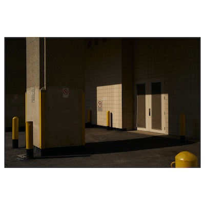

# white_backgroundify

---

🚧 **This is a WIP!** 🚧

---

This script takes input images and pastes them onto a new image with a white background. The new image's width will be `2160`px by default (configurable via a script argument) and its height will be dependent on the format provided.

Example (images have been scaled down for demonstration purposes):

#### Input Image


#### Output Image (using `1x1` format)


# Installation

1. Install the [Requirements](#requirements) below.
2. Clone this repo or download the script itself.
3. (Optional but recommended) Create a symlink for convenience:
```
➜ cd /usr/local/bin
➜ ln -s path/to/white_backgroundify.py white_backgroundify
```

# Usage

Given a folder `some/folder/with/images` with the following contents:
```
my_image_1.jpg
my_image_2.jpg
my_image_3.jpg
```
Use `white_backgroundify.py` like this:
```
➜ ./white_backgroundify.py --format=4x5 --width=1000 some/folder/with/images/*.jpg
Created some/folder/with/images/white_bg/4x5/my_image_1_white_bg.jpg
Created some/folder/with/images/white_bg/4x5/my_image_2_white_bg.jpg
Created some/folder/with/images/white_bg/4x5/my_image_3_white_bg.jpg
```

# Arguments

* `--help`: Shows a help doc.
* **(Required)** `--format`: The desired crop of the output file (e.g. `2x3`, `4x5`, `1x1`, etc.)
* (Optional) `--width`: The desired width of the output file.

# Notes

* The output path of each image will be
  ```
  <input image's folder>/white_bg/<mode>/<input image name>_white_bg.<input image extension>
  ```
  so it's more convenient to use on a single folder with a wildcard path (e.g. `*.jpg`) instead of individual images with separate paths. This is still possible, but you may end up with multiple  `white_bg/` folders if the provided images aren't in the same folder.
* This has only been tested with JPGs. 
* This hasn't been tested much.

# Requirements

* Python 3.7.5
* [Pillow 8.3.1](https://pypi.org/project/Pillow/8.3.1/)

# Why Should You Use This?

Use this if you don't want to faff around with a photo editor's automate/batch function.

# Future Considerations

* Make more options configurable through command line arguments:
  * Image quality
  * Margin
* Make crop formats adaptable (e.g. make 4x5 work with 5x4) – ideal for print
